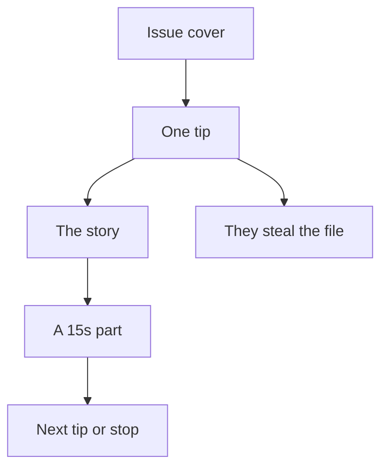

# Graph

How a person walks this mag. Same idea as a teaching graph. Smaller.

```mermaid
flowchart TD
  cover[Issue cover] --> tip[One tip]
  tip --> story[The story]
  story --> short[A 15s part]
  short --> next[Next tip or stop]
  tip --> steal[They steal the file]
```

You do not dump MCP. You do not dump the factory.
They take one tip. They film if they want. They leave.
